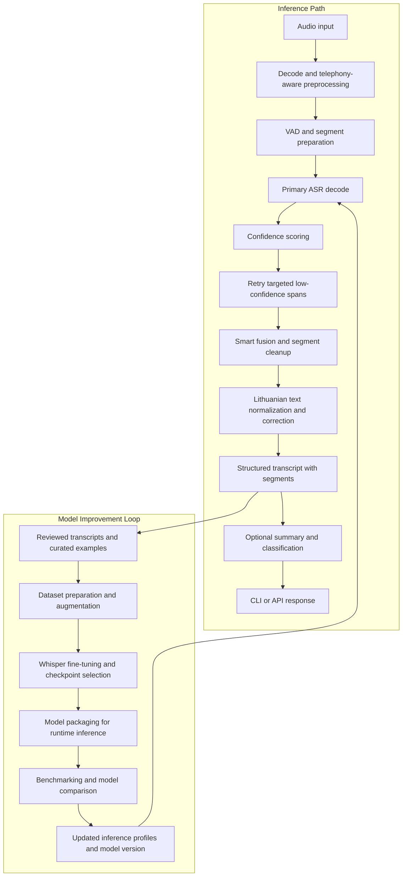

# Architecture Flow



## How to Read the Flow

### Inference-Time Stages

The top half of the diagram is the runtime path used when new audio arrives:
- audio is normalized and prepared for telephony-style decoding,
- the ASR pipeline generates an initial transcript,
- low-confidence regions can be retried and fused back into the result,
- then the transcript is cleaned and optionally enriched before being returned through the CLI or API.

These stages correspond most directly to the runtime modules in `src/asr/`, `src/api/server.py`, and the optional post-processing modules in `src/llm/` and `src/hunspell/`.

Minimal code anchors for this path:
- `ASRPipeline.transcribe_file(...)` in `src/asr/pipeline.py`
- `collect_low_confidence_jobs(...)` and `should_replace_segment(...)` in `src/asr/smart_fusion.py`
- `generate_summary_and_classification(text)` in `src/llm/qwen_classifier.py`

Minimal real code anchor:

```python
result = asr.transcribe_file(audio_path)
jobs = collect_low_confidence_jobs(...)
```

Typical edge conditions here are noisy telephony audio, overlapping speakers, clipped spans, and unstable segmentation. The pipeline handles them by improving the signal before decode, retrying only weak regions, merging or cleaning unstable segments, and keeping transcript normalization after recognition rather than assuming the first decode is final.

### Model Improvement Loop

The lower half is the improvement loop that feeds the runtime system:
- reviewed and curated transcripts become training-ready data,
- datasets are expanded or augmented,
- candidate models are fine-tuned and packaged,
- and new versions are compared before being promoted back into inference.

This loop is represented in the repository by `dataset_builder/` and evaluation utilities such as `tools/compare_asr_v1_v2.py`.

Minimal code anchors for the loop:
- `Seq2SeqTrainer` setup in `dataset_builder/finetune_whisper.py`
- `pipeline.transcribe_file(audio_path)` inside `tools/compare_asr_v1_v2.py`

Minimal real code anchor:

```python
trainer = Seq2SeqTrainer(**trainer_kwargs)
```

This makes the connection explicit:
- inference produces transcripts and segment-level behavior,
- post-processing makes that output more usable,
- the API packages the result for downstream systems,
- and reviewed outputs can feed the next round of dataset and model updates.

### Why Retry / Fusion and Cleanup Exist

Confidence-aware retry and fusion exist because hard call-audio errors are often local rather than global. A full file may be mostly correct while a few segments fail because of noise, overlap, clipping, or poor boundaries. Retrying only the weak regions is a more practical strategy than rerunning the entire decode blindly.

Lithuanian text cleanup exists because even a usable raw transcript may still contain spacing issues, recognition artifacts, or language-specific inconsistencies that reduce readability and downstream usefulness. Cleanup and correction make the transcript more stable for people, summaries, and classification tasks without changing the overall purpose of the pipeline.

## Runtime Trade-Offs

- Retry and fusion improve hard segments, but they cost more than a strict single-pass decode.
- Optional downstream enrichment increases usefulness, but it is kept logically separate from the main inference path so latency can be managed.
- Sequential or coordinated execution is often preferable to unrestricted parallelism when inference is GPU-bound and quality-sensitive.
