# Lithuanian Telephony ASR System

End-to-end speech recognition pipeline designed for real-world Lithuanian call audio.

This repository documents an end-to-end speech pipeline built for Lithuanian call recordings. The system combines telephony-aware audio preprocessing, Whisper-based automatic speech recognition, transcript cleanup, API delivery, and a supporting workflow for dataset preparation, fine-tuning, and evaluation.

The system is designed around practical constraints of real call audio: low-quality signals, unstable segmentation, partial recognition failures, and the need to iteratively improve model performance. Instead of focusing on a single model, the repository reflects the full inference pipeline and the surrounding components required to make transcription reliable in practice.

---

## Architecture Overview



---

## High-Level Pipeline

audio  
→ preprocessing  
→ ASR decoding  
→ retry low-confidence segments  
→ fusion  
→ transcript cleanup  
→ structured output  
→ optional summary/classification  

---

## What Problem It Solves

Generic speech models often degrade on narrow-band, noisy call recordings. In practice, this leads to missing words, unstable timestamps, fragmented segments, and transcripts that are difficult to use downstream.

This system addresses that by building a structured pipeline around the model:
- improving audio quality before decoding,
- handling low-confidence segments through targeted retries,
- cleaning and normalizing transcripts for Lithuanian language usage,
- exposing results through a service layer,
- and maintaining a feedback loop for model improvement.

---

## Where This System Adds Value

Compared with running a raw ASR model directly, this system adds value in three areas:

- **Before decoding**: prepares telephony audio so the model can operate more consistently  
- **After decoding**: improves weak segments and removes transcript artifacts  
- **Over time**: connects reviewed data, fine-tuning, and evaluation back into the same runtime pipeline  

---

## How the System Fits Together

- **Runtime inference**: `src/asr/` handles preprocessing, transcription, segmentation, retry logic, and result shaping  
- **API/service layer**: `src/api/server.py` exposes transcription, summary, and classification endpoints  
- **Post-processing**: `src/hunspell/` and `src/llm/` improve transcript quality and downstream usability  
- **Model-development workflow**: `dataset_builder/` and `tools/` support dataset preparation, fine-tuning, and evaluation  

---

## Minimal Code Anchors

```python
result = asr.transcribe_file(audio_path, fusion_mode=fusion_mode)
llm_meta = qwen.generate_summary_and_classification(full_text)
```

```python
@app.post("/transcribe")
def transcribe_audio(...):
```

---

## System Design Highlights

- Telephony-aware preprocessing is treated as part of the ASR pipeline  
- Confidence-aware retry and fusion improve difficult segments without rerunning entire files  
- Transcript cleanup combines deterministic rules with model-based correction  
- The service layer is designed around GPU-bound inference constraints  
- Training and evaluation are integrated with the runtime system  
- The repository supports both CLI-based inspection and API-based usage  

---

## Engineering Challenges

- Low-quality telephony audio: compression artifacts, noise, and uneven levels  
- Segmentation instability: incorrect or fragmented boundaries affect decoding quality  
- Partial recognition failures: isolated segments can fail even when the rest is correct  
- Transcript cleanup: raw output is not always suitable for users or downstream systems  
- Serving constraints: balancing quality improvements with latency and resource limits  
- Iterative improvement: model performance depends on repeated data curation and evaluation  

---

## Technology Stack

- Python  
- Faster-Whisper / CTranslate2  
- FastAPI, Pydantic, Uvicorn  
- PyTorch, Hugging Face Transformers, Datasets  
- FFmpeg, WebRTC audio processing, Silero VAD  
- NumPy, SciPy, SoundFile  
- Hunspell  
- Local LLM integration  
- pytest  

---

## Contribution Summary

My work in this repository includes:

- building and iterating on the Lithuanian telephony ASR pipeline  
- implementing parts of preprocessing, segmentation, retry, and cleanup logic  
- contributing to the service-facing transcription and enrichment flow  
- developing tooling for dataset preparation, augmentation, and fine-tuning  
- comparing model versions and tuning inference behavior  
- adding regression checks for core pipeline behavior  

---

## Context

This project was developed as part of an AI engineering internship and reflects work on real-world telephony audio and production-oriented constraints.

---

## Documentation

- [Project Overview](./PROJECT_OVERVIEW.md)  
- [Architecture Flow](./ARCHITECTURE_FLOW.md)  

---

## Public-Safe Note

This repository is intentionally written for public portfolio use. It describes system architecture and engineering scope while omitting private infrastructure details, credentials, internal endpoints, and client-specific context.
